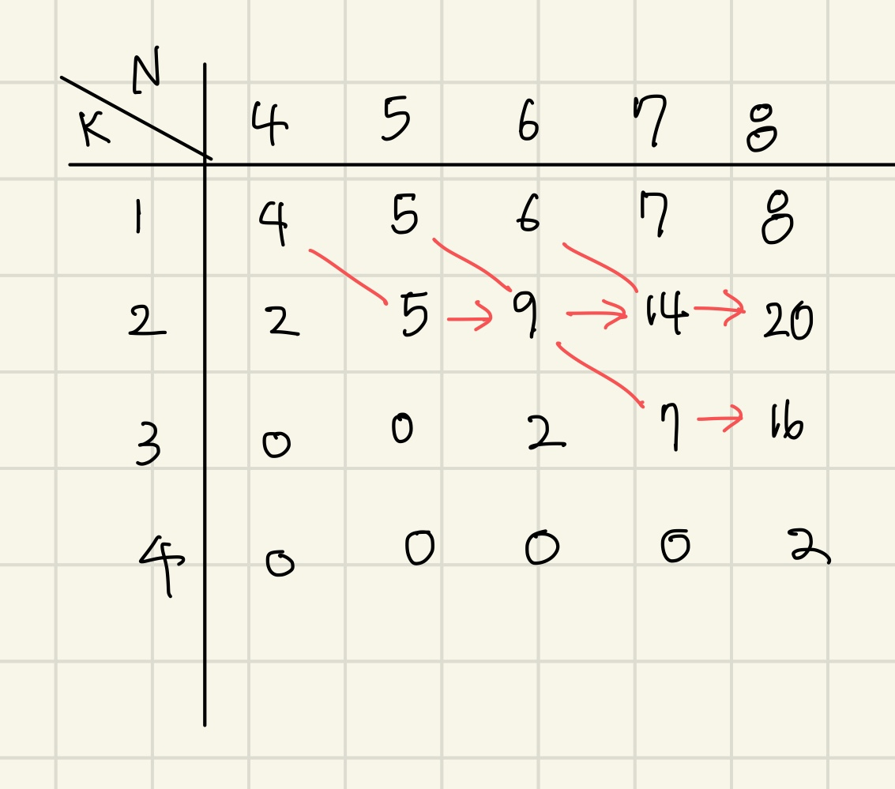

# 5월 4주차 풀이
## 1. BOJ S1 16918 봄버맨💣
### 문제 정의

1. 봄버맨이 설치한 폭탄은 상하좌우도 함께 파괴된다.
2. 초기값으로 일부 칸에 설치된 폭탄은 '0', 빈칸은 ','으로 주어진다.

    1초: 빈칸에 새로운 폭탄 설치

    2초: 3초 전 설치한 폭탄 폭파

    3초: 빈칸에 새로운 폭탄 설치

    4초: 3초전 설치한 폭탄 폭파

    ...

4. 격자판 R, C과 시간 N이 주어질 때 N초 후 격자판의 상태를 출력하시오

5. 1 ≤ R, C, N ≤ 200

### 문제 풀이

1. bomb리스트를 만들어서 폭파할 폭탄들의 좌표를 입력한다.
2. N이 짝수일때는 무조건 격자판이 full, 홀수일때만 체크하면 된다.

    1초: bomb에 초기 폭탄 좌표 입력

    3초: 1초에 있는 bomb에 있는 폭탄 터뜨리기, 남은 'O'(폭탄) 입력

    5초: 3초에 있는 bomb에 있는 폭탄 터뜨리기, 남은 'O'(폭탄) 입력

### 정리

문제 이해를 못해서 한참을 헤맸었다.

----

### 2. BOJ G4 1918 후위표기식 ➕
# 문제 정의

1. +, -, *, /, (, )로 구성된 중위표기식이 주어질 때 후위표기식으로 바꾸시오. 피연산자는 A-Z로 구성됨
2. 길이는 100을 넘지 않는다.

### 문제 풀이

1. A~Z가 들어오면 무조건 정답에 붙인다.
2. `)`는 `(`가 나타날때까지 stack에서 연산자를 pop해서 정답에 붙인다.
3. `*` , `/` 는 `+`, `-`보다 우선순위가 높으니 stack에서 같은 우선순위인 `*`, `/`만 pop해서 정답에 붙인다. A+(B*C) 경우도 고려해서 stack이 비지 않고, peek이 `(`이 아니거나  `*`, `/` 인 경우만 반복문으로 pop해야 한다.
4. `+`, `-`는 우선순위가 낮은 애들이므로  stack이 비지 않고 peek이 `(`이 아닐때까지 반복문으로 pop해서 정답에 붙여준다.

### 정리

처음 문제를 읽었을 때 괄호가 있는 중위표기식만 들어오는 줄 알고 금방 풀었는데 틀려서 당황했었다. 질문게시판에서 반례를 찾아서 한참 이것저것 아이디어를 구상했는데 처음엔 안풀리다가 가닥을 잡으니까 후루룩 풀렸다.

---
## 3. BOJ G4 1918 색상환 🎨
#### 문제 정의

1. N개의 색 중 인접하지 않은 K개를 뽑는 개수를 구하시오
2. 4 ≤ N ≤ 1000, 1 ≤ K ≤ N

#### 문제 풀이

1. dp문제
2. n개 중  k개를 뽑는 경우는 현재 n번째 색: n-1번째  색을 뽑고 n을 안뽑는 경우 + n-2번째 색을 뽑고 n을뽑는 경우
3. 점화식으로 dp[n][k] = dp[n-1][k] + dp[n-2][k-1]
4. n개에서 1개를 뽑을 땐 무조건 n개의 경우의 수가 나오므로 처음에 dp[i][1] = i (1≤ i ≤ N)으로 초기화해야 한다.

#### 정리

정말 이해가 안돼서 블로그 보고 겨우 풀었다. 내 실력으로 푼게 아니라 나중에 다시 풀어봐야지. 테이블로 그려서 푸니까 왜 dp[n][1]가 n이 되는지 이해가 됐다. 앞으로 dp문제는 테이블을 꼭 그려야지!